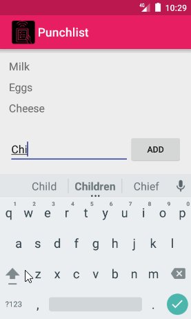

# *Punchlist*

**Punchlist** is an Android app that allows building a to-do list and basic to-do item management functionality, including adding new items, and editing and deleting an existing item.

Submitted by: **Erik Cox**

Time spent: 11 hours spent in total

## User Stories

The following **required** functionality is completed:

* [x] User can **successfully add and remove items** from the todo list
* [x] User can **tap a todo item in the list and bring up an edit screen for the todo item** and then have any changes to the text reflected in the todo list.
* [x] User can **persist todo items** and retrieve them properly on app restart

The following **optional** features are implemented:

* [x] Added app icon in ActionBar
* [X] Changed text fields to *textCapSentences* to capitalize the first letter of a to-do
* [x] To-do item list scrolls to the bottom when a new item was added
* [x] Added padding between ListView items for readability
* [x] To-do items are persisted in SQLite via [ActiveAndroid](http://www.activeandroid.com/) instead of a text file
* [x] To-do items have been styled with a custom adapter
* [x] Replaced the edit item Activity with an edit item DialogFragment.
* [x] Added *Stetho* for debugging and *Firebase* for analytics.
* [x] Added a *due date* with a DatePicker dialog to to-do items.

## Video Walkthrough 

Here's a walkthrough of implemented user stories:

GIF created with [LiceCap](http://www.cockos.com/licecap/).

## Notes

* I had some trouble verifying the data passed back in the EditActivity.
* I ran into a bug with Android Studio's Instant Run feature with regards to Active Android. I found a fix [here](http://stackoverflow.com/a/36509952/483658).
* I kept getting the error *Cannot resolve symbol R*. This was resolved by doing a **Build->Clean Project** and **Sync Project with Gradle Files**.
* I had some issues formatting dates with the DatePicker. If worked fine with Y/M/D & D/M/Y, but not M/D/Y.
## License

    Copyright [2016] [Erik Cox]

    Licensed under the Apache License, Version 2.0 (the "License");
    you may not use this file except in compliance with the License.
    You may obtain a copy of the License at

        http://www.apache.org/licenses/LICENSE-2.0

    Unless required by applicable law or agreed to in writing, software
    distributed under the License is distributed on an "AS IS" BASIS,
    WITHOUT WARRANTIES OR CONDITIONS OF ANY KIND, either express or implied.
    See the License for the specific language governing permissions and
    limitations under the License.
